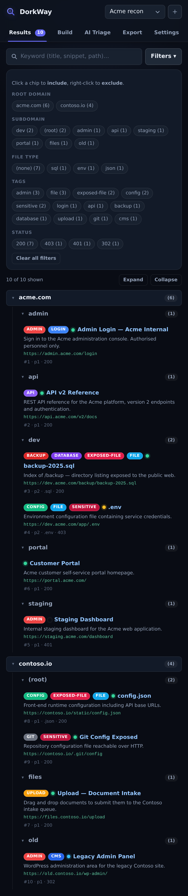
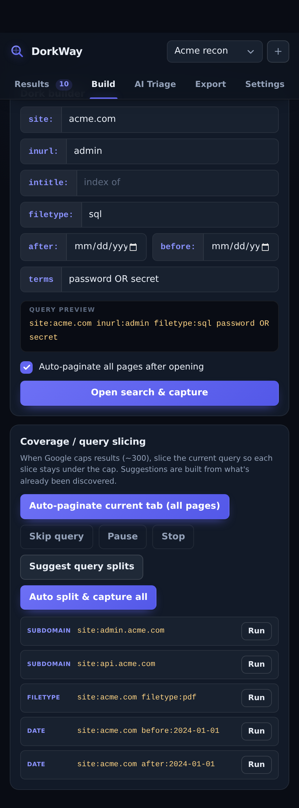
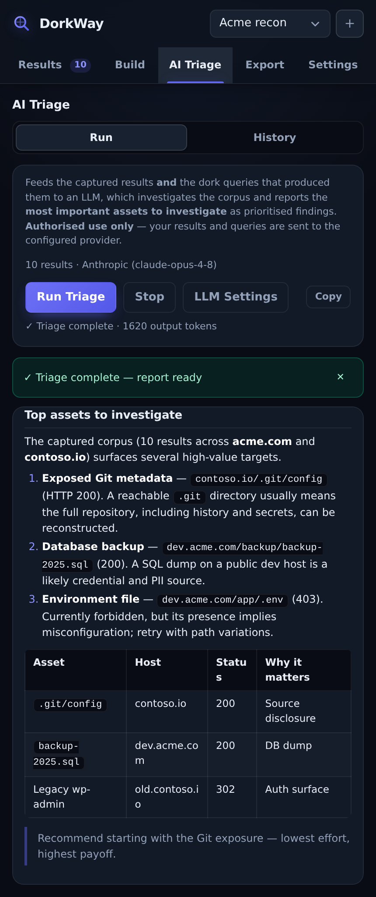
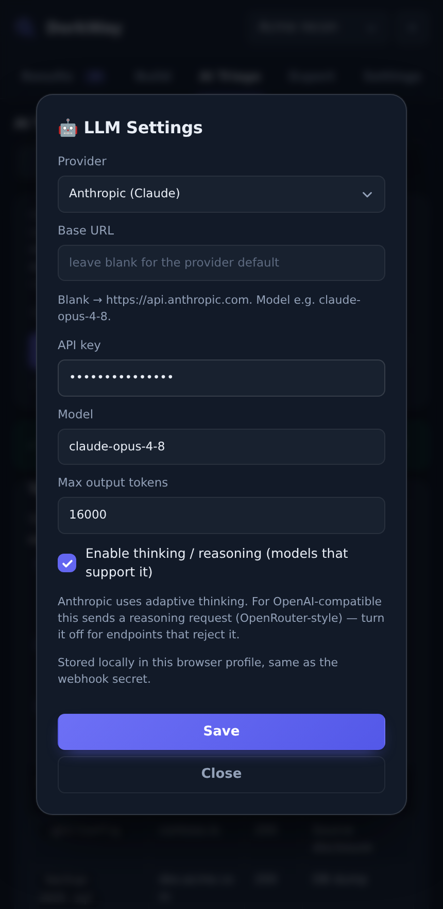
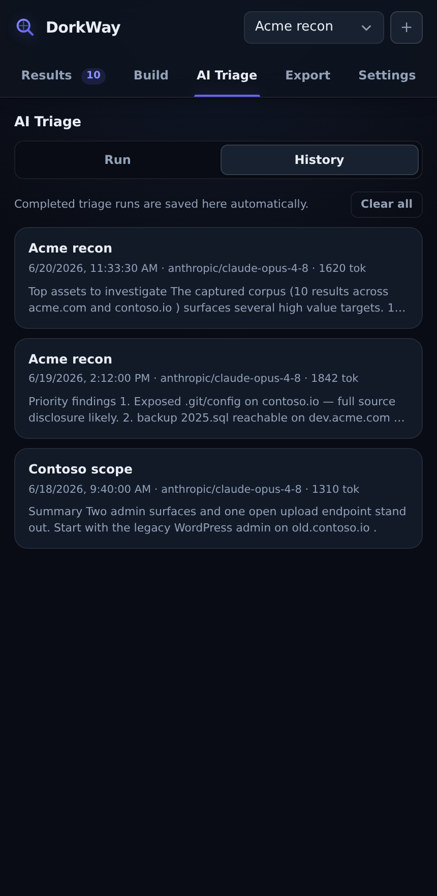
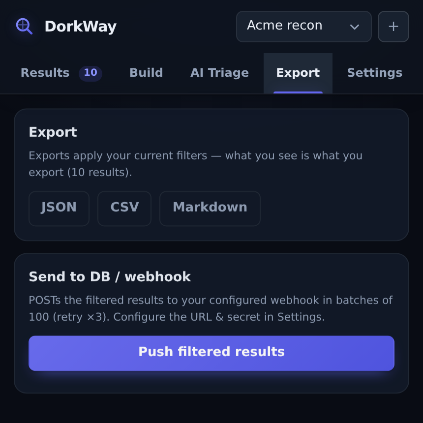
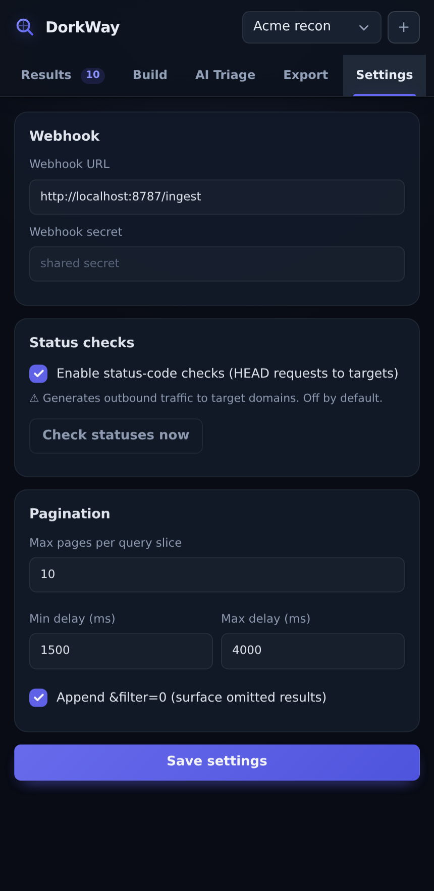

# DorkWay

A Chrome extension for Google dorking sessions. It runs on Google Search results
pages, captures every result as a structured record, groups them by domain, auto-tags them, and
gives you filtering, export, and an optional LLM triage pass — all from a side panel that stays
open while you work.

No build step. It's plain ES modules; load the folder unpacked and it runs.

> ⚖️ **Authorised use only.** DorkWay is for security research and OSINT against assets you own
> or are explicitly permitted to test. You are responsible for complying with applicable laws,
> scope agreements, and Google's Terms of Service. The optional status-code check and AI triage
> send outbound requests (to target domains and to your configured LLM provider, respectively).

---

## Install

1. Open `chrome://extensions`
2. Enable **Developer mode** (top-right)
3. **Load unpacked** → select the project folder (the one with `manifest.json`)
4. Pin DorkWay and click its toolbar icon to open the side panel
5. Accept the first-run authorisation notice

Requires Chrome 114+ (for `chrome.sidePanel`).

## Capture a session

Run any search on `https://www.google.com/search?q=…` and DorkWay captures the page
automatically — an on-page pill shows progress. Or skip Google's box entirely and compose a
dork in the **Build** tab. Either way, results land in the side panel grouped by
**root domain → subdomain**.

---

## The panel, tab by tab

The panel has five tabs. Each is covered below.

### Results



Everything you've captured in the current session, as a collapsible
**root domain → subdomain → result** tree. Each result shows its title, snippet, cleaned URL,
auto-tags, SERP rank/page, and a status dot (grey = unchecked, otherwise the HTTP code).

- **Keyword box** filters across title, snippet, and path.
- **Filters** (the drawer in the screenshot) gives faceted chips for root domain, subdomain,
  URL directory (two folded views — group by the 1st path segment, e.g. `/wp-content`, or by the
  1st two, e.g. `/wp-content/uploads`), file type, tags, and
  status. **Left-click a chip to include, right-click to exclude.** Counts
  cross-filter — picking a root narrows the other facet lists to what's still reachable.
- **Expand / Collapse** toggle the whole tree.

The result count in the tab badge is the session total; the summary line shows how many pass the
current filters. Exports and webhook pushes act on the filtered set, not the whole session.

### Build



Compose and run dorks without touching Google's search box.

- **Dork builder** — fields for `site:`, `inurl:`, `intitle:`, `filetype:`, `after:`/`before:`,
  and free terms. The preview updates live. **Open search & capture** opens the query in a tab
  and (optionally) auto-paginates it.
- **Coverage / query slicing** — Google caps a query at ~300 results. *Auto-paginate current
  tab* walks `&start=0,10,20…` with `&filter=0` and jittered delays until Google runs out of
  results or shows a CAPTCHA (hard ceiling: 100 pages). Pause/resume, skip the current query, or
  stop at any time.
- **Suggest query splits** proposes subdomain-walk, filetype, and date-bisection slices that each
  stay under the cap. **Auto split & capture all** runs every suggestion back-to-back in one tab.
  Their union (deduped by URL hash) becomes your dataset, and each result keeps its `sourceQuery`.

### AI Triage



Hands the captured corpus and the dork queries that produced it to an LLM, which works through the
results and reports the **assets most worth investigating** as a ranked, Markdown report.

The agent isn't dumped a raw list — the background builds an inventory overview and the model pulls
records itself via tools (`get_results`, `get_stats`, `run_dork`, `check_status`). Tool calls,
thinking, and the streamed report all show inline as it runs. **Run Triage** starts it; **Stop**
aborts; **Copy** grabs the raw Markdown.

Provider and key are set in **LLM Settings** (button on the tab):



Anthropic (Claude) and any OpenAI-compatible endpoint (OpenAI, OpenRouter, local servers) are
supported. The key is stored in this browser profile, the same as the webhook secret. Optional
thinking/reasoning is on by default for models that support it.

Completed runs are saved to the **History** sub-tab — newest first, capped at 30 — so you can
re-read or copy a past report without re-running it.



> Triage sends your results and queries to the configured provider. Authorised use only.

### Export



Export the **filtered** set — what you see in Results is what you get.

- **JSON / CSV / Markdown** download straight to disk. Markdown is a grouped recon report.
- **Push filtered results** POSTs to your webhook (configured in Settings) in batches of 100,
  retrying failed batches up to 3× with backoff.

### Settings



- **Webhook** — URL and optional secret, sent as `X-DorkWay-Secret`.
- **Status checks** — off by default. When on, DorkWay sends HEAD probes to target domains to fill
  in status codes (2 concurrent). This generates outbound traffic, so it asks for host permission
  on first use.
- **Pagination** — max pages per slice, the min/max jitter delay between pages, and whether to
  append `&filter=0` to surface Google's omitted results.

---

## The `ResultEntity` model

Every result is captured in full — never the URL alone:

| Field | Meaning |
|---|---|
| `id` | SHA-256 of the cleaned URL — the dedup key |
| `title` | Clickable headline text |
| `url` | Full href, tracking params (`utm_*`, `fbclid`, `gclid`, …) stripped |
| `rootDomain` | Registrable domain, e.g. `target.co.uk` |
| `subdomain` | Everything left of root excluding `www`, e.g. `api.dev` |
| `path` | URL path, e.g. `/backup/db.sql` |
| `fileType` | Extension derived from path, e.g. `sql` |
| `queryParams` | Remaining query string after cleaning |
| `snippet` | Descriptive text under the title |
| `tags[]` | Auto-assigned (see below) |
| `sourceQuery` | The exact dork(s) that produced this result |
| `rank` | 1-based SERP position, global across pages |
| `page` | Which results page it came from |
| `statusCode` | HTTP status (0 = unchecked) |
| `capturedAt` | ISO 8601 timestamp |

Extraction is **single-pass**: title, URL, and snippet are read from the same result container
(located by stable `data-hveid`/`h3` structure, with a fallback selector chain), so they always
belong to the same result.

**Auto-tags** — `login`, `admin`, `api`, `upload`, `backup`, `config`, `exposed-file`, `git`,
`sensitive`, `database`, `idor`, and more, assigned from the path/query on extraction (see
`lib/tags.js`).

**Storage** — IndexedDB (`DorkWayDB`) with `sessions` and `results` stores. On write, a duplicate
`id` merges `tags` and `sourceQuery` and keeps the best rank / non-zero status rather than
overwriting. Sessions persist across navigations and are exportable at any time.

---

## Webhook payload

`POST <webhookUrl>` with header `X-DorkWay-Secret: <shared secret>` (omitted if no secret set):

```jsonc
{
  "session": { "sessionId": "s_…", "name": "Recon" },
  "batch": 1,            // 1-based chunk index
  "batches": 3,          // total chunks
  "results": [ /* array of ResultEntity, ≤100 per request */ ]
}
```

Results are chunked into groups of 100, each sent with the secret header and retried up to 3× with
exponential backoff (0.5 s, 1 s, 2 s). Your endpoint should ack each batch with `200 {ok:true}`.

---

## Project layout

```
DorkWay/
├── manifest.json
├── background.js         # service worker: store, pagination, status, webhook, triage agent
├── content.js            # SERP extraction + pagination driver
├── lib/
│   ├── url-clean.js       # URL cleaning, tracking-param strip, SHA-256
│   ├── domain.js          # registrable-domain / subdomain (PSL subset)
│   ├── tags.js            # auto-tag engine
│   ├── extractor.js       # single-pass DOM -> ResultEntity
│   └── db.js              # IndexedDB wrapper (DorkWayDB)
├── sidepanel/            # the side-panel UI (vanilla JS/HTML/CSS)
├── icons/
└── docs/screenshots/     # the images in this README
```

---

## Notes & limitations

- **Google DOM churn** — selectors target stable structure (`data-hveid`, `a > h3`) with a
  fallback chain; an unparseable result is skipped with a console warning rather than crashing.
  Zero-result, "did you mean", and knowledge-panel pages are handled without throwing.
- **Domain parsing** — `lib/domain.js` ships a curated Public Suffix List subset (`co.uk`,
  `com.au`, `github.io`, S3/Heroku/Vercel, etc.). For exhaustive coverage, swap in
  [`tldts`](https://www.npmjs.com/package/tldts); `parseHost()` is the single seam to replace.
- **Rate limiting** — delays are randomised and capped by max-pages. Solve CAPTCHAs manually;
  DorkWay halts and saves state rather than pushing through them.
- **Privacy** — status checks and AI triage both generate outbound traffic and are explicit
  actions. Use only within scope.
